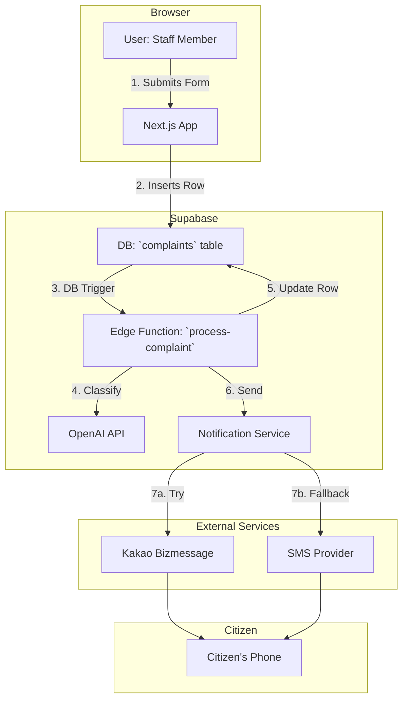

Of course. As a senior technical architect, I will transform the provided TRD into a lean, actionable specification focused entirely on delivering the 3-day MVP.

The original TRD is well-structured but over-engineered for a 3-day build. It includes architectural theories, file structures, and future-proofing considerations that are unnecessary noise for this sprint.

Here is the revised, minimalistic TRD.

---

# **Lean TRD: AI Civil Complaint Assistant (3-Day MVP)**

This document outlines the minimum technical requirements to build and deploy the MVP in 3 days. It is a guide for implementation, not an exhaustive architectural treatise.

## 1. Core Technical Objective
Deploy a functional SaaS MVP using the prescribed Next.js/Supabase stack that automates the classification, response drafting, and notification for civil complaints.

## 2. System Architecture & Data Flow

The architecture is a standard serverless web application. The flow is straightforward:



**Flow Description:**
1.  **Submission:** Staff submits a new complaint via a Next.js form.
2.  **DB Insert:** A new record is created in the `complaints` table with `status: 'new'`.
3.  **Trigger:** A database trigger invokes the `process-complaint` Edge Function.
4.  **AI Processing:** The function calls OpenAI GPT-4o to get the category and assign a handler. It then updates the complaint record.
5.  **Notification:** The function (or another triggered function) sends a "Receipt Acknowledged" notification via the Kakao/SMS service.

## 3. Core Implementation Details

### 3.1. Database Schema (PostgreSQL)

Create one primary table. Users are handled by Clerk.

```sql
-- Civil Complaints Table
CREATE TABLE complaints (
    id UUID PRIMARY KEY DEFAULT gen_random_uuid(),
    created_at TIMESTAMPTZ DEFAULT now() NOT NULL,
    office_id UUID NOT NULL, -- Foreign key to an office/team table
    complainant_name TEXT,
    complainant_contact TEXT NOT NULL, -- Phone number for notifications
    content TEXT NOT NULL,
    category TEXT, -- Populated by AI
    status TEXT DEFAULT 'new' NOT NULL, -- e.g., 'new', 'assigned', 'replied'
    assigned_to_id UUID, -- Clerk user ID, populated by AI
    ai_drafted_reply TEXT
);

-- Enable Row-Level Security
ALTER TABLE complaints ENABLE ROW LEVEL SECURITY;
CREATE POLICY "Users can only see complaints for their office"
    ON complaints FOR SELECT
    USING (office_id = auth.jwt() ->> 'office_id'); -- Example RLS
```

### 3.2. Core Logic (Supabase Edge Functions)

**A. `process-complaint` (Triggered on new complaint insert)**
-   **Input:** `complaint_id`.
-   **Steps:**
    1.  Fetch the complaint `content` from the database.
    2.  Call OpenAI GPT-4o API using a hardened system prompt.
        -   **Prompt Goal:** Request a JSON object containing `category` (from a predefined list of 10) and `assigned_to_id` (based on category-to-user mapping).
        -   **Example JSON Output:** `{ "category": "환경/미화", "assigned_to_id": "user_clerk_uuid_..." }`
    3.  Update the complaint row with the `category`, `assigned_to_id`, and set `status` to `'assigned'`.
    4.  Invoke the `send-notification` function with `complaint_id` and message type `'receipt'`.

**B. `generate-reply-draft` (Triggered by user action from the frontend)**
-   **Input:** `complaint_id`.
-   **Steps:**
    1.  Fetch complaint `content` and `category`.
    2.  Call OpenAI GPT-4o with a prompt including the content, category, and a reference to FAQ templates.
    3.  Update the complaint row with the `ai_drafted_reply`.

**C. `send-notification` (Can be called from other functions)**
-   **Input:** `complaint_id`, `message_type` (e.g., 'receipt', 'reply_sent').
-   **Steps:**
    1.  Fetch `complainant_contact` from the `complaints` table.
    2.  Select the appropriate message template.
    3.  Attempt to send via Kakao Bizmessage API.
    4.  If Kakao API fails (or is not approved), send via SMS fallback.
    5.  Log the send status (success/failure, channel used).

## 4. Non-Functional Requirements (MVP Scope)

-   **Performance:**
    -   API Response (Form submission, data fetch): **< 300ms**.
    -   End-to-end Notification Latency (from submission to phone): **< 5 seconds**.
-   **Security:**
    -   Authentication is handled by **Clerk**.
    -   Authorization is handled by **Supabase RLS** (Row-Level Security). No user should see data from another office.
-   **Availability:**
    -   Target **99%** uptime.
    -   Notification channel must be redundant (**SMS fallback** is mandatory).

## 5. 3-Day Implementation Plan

-   **Day 1: Foundation & Submission**
    -   [ ] Init Next.js/Supabase project.
    -   [ ] Implement Clerk for user login.
    -   [ ] Define and migrate the `complaints` DB schema.
    -   [ ] Build and deploy the complaint submission form (frontend).
    -   [ ] Build a basic inbox UI to list all complaints (no actions yet).

-   **Day 2: Core Automation**
    -   [ ] Develop and deploy the `process-complaint` Edge Function.
    -   [ ] Integrate OpenAI API for classification & assignment. Define initial prompt.
    -   [ ] Develop and deploy the `send-notification` Edge Function with Kakao/SMS integration.
    -   [ ] Set up the DB trigger to connect the submission form to the AI function.

-   **Day 3: Closing the Loop & Deployment**
    -   [ ] Add a "Generate Draft" button to the inbox UI that calls the `generate-reply-draft` function.
    -   [ ] Display the `ai_drafted_reply` in the UI with an editable textarea.
    -   [ ] Implement the "Send Reply" button, which updates the complaint `status` to `'replied'` and triggers the `send-notification` function.
    -   [ ] Final integration testing and deploy to production for pilot onboarding.